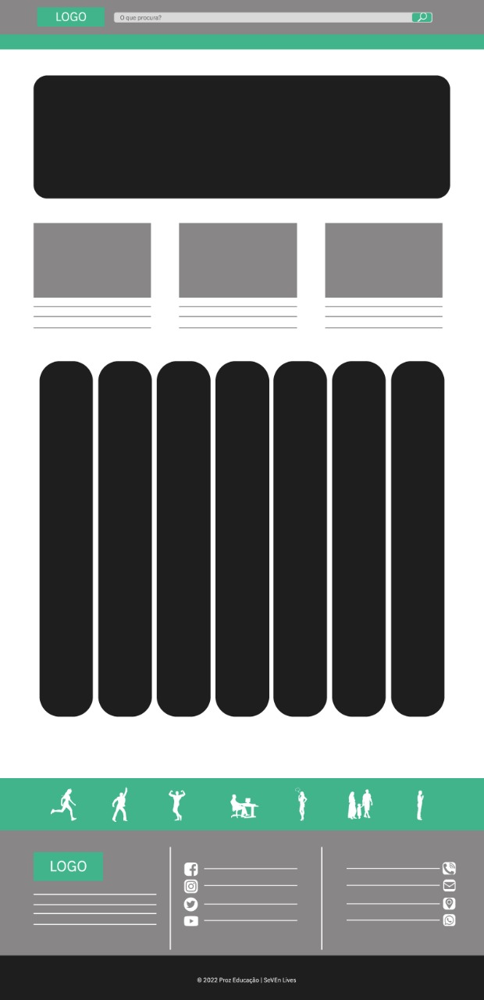
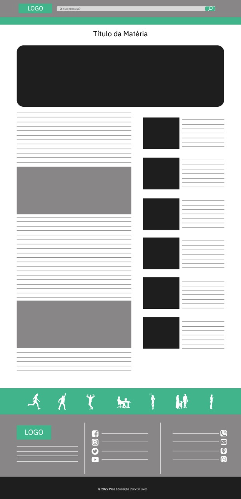

# Apresentação do Projeto + Layout
## Descrição do projeto

Além de fazer parte de um Projeto de Introdução a tecnologia, este projeto nos proporcionará olhar para alguns aspectos da vida de forma diferente do habitual.

Somos uma equipe, e como na vida cada ser humano olha o mundo ao seu redor de forma única, nossa ideia é poder transportar para os futuros leitores a nossa visão do que é bom, agradável e saudável para cada pessoa que, de alguma forma, se sinta conectada com o nosso modo de ver as coisas boas que a vida pode proporcionar. A decisão de abordar os 7 aspectos partiu do nome do grupo (grupo-7). O blog se chamará **SeVEn Lives**

Funcionalidades do site:

Mostrar para os usuários um Blog com visão de pessoas reais, detalhando experiências, dicas e trazendo curiosidades.

O Layout do projeto encontra-se aqui neste link no [figma](https://www.figma.com/file/v0dzwWOx9L3CC8A5hrAGuZ/Projeto-Proz-SeVEn?node-id=0%3A1&t=0eBFsGl8RtVi4Cob-1)